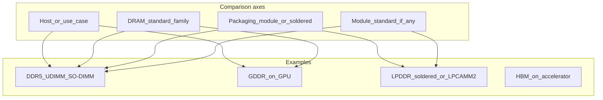

# RAM literacy: authoritative content spec, design system, Astro site

## Content policy (final)

The site teaches **definitions, roles, and standards**, not benchmark-like comparisons or rumor-tier claims.

**Include**

- What each acronym **stands for** and **where it is used** (PC main memory, discrete GPU, mobile/embedded, AI accelerator packages).
- **DRAM standard vs module form factor**: e.g. DDR5 is a **standard**; UDIMM / SO-DIMM are **module types** that carry DDR SDRAM chips.
- **Architectural facts** that are textbook-stable: GDDR is tailored for **parallel** GPU-style traffic and **wide interfaces**; DDR-style SDRAM for **general-purpose** hosts emphasizes **different controller constraints** than stacked accelerator memory (without naming a numeric latency ratio).
- **HBM**: stacked DRAM using **through-silicon vias (TSVs)**; **bandwidth** is the headline design goal for accelerator packaging. Where numbers appear, use **named products + vendor specification pages** (e.g. accelerator memory bandwidth quoted by NVIDIA or AMD for a specific SKU)—not hand-waved ranges.
- **LPDDR**: **low-power** DDR family; appears soldered on phones/laptops and in **single-pool** CPU+GPU memory designs on some SoCs (describe as **shared physical memory**, not a proprietary trademark).
- **Registered memory**: **RDIMM** uses registering buffers on **command/address** paths so servers can populate **many modules** while maintaining signal integrity; **LRDIMM** adds further buffering for very large capacities—describe purpose, not hype.
- **CUDIMM / CSODIMM** (JEDEC **JESD323** family): **Clocked** Unbuffered modules include a **client clock driver** on the module to improve **clock signal integrity** at high DDR5 transfer rates; **not** the same problem as RDIMM (no claim that “all future DDR uses only CUDIMM”).
- **CAMM2 / LPCAMM2**: **module standards** for compression-attached modules; **LPCAMM2** uses **LPDDR** DRAM and is positioned by vendors as **upgradeable** vs soldered LPDDR—cite module docs for **interface width** (e.g. **128-bit** per LPCAMM2 module in vendor briefs) rather than inventing totals.
- **MRDIMM**: **Multiplexed Rank DIMM**—**server** DDR5 module direction standardized under JEDEC for **higher effective throughput per channel** via multiplexed ranks and associated buffer chips (**not** “server CUDIMM”; clock buffering on CUDIMM addresses **client** signal integrity at speed).

**Exclude**

- Multiplicative claims (**×15 bandwidth**, **×3–5 latency**) and any **GDDR vs DDR** numeric latency gap stated as a universal rule.
- Arguing whether **HBM** is “slower” or “faster” than GDDR in the abstract (depends on access pattern and subsystem); replace with **design intent**: bandwidth-oriented stacked memory on-package for accelerators.
- **ZAM**, **DDR6-only-CUDIMM**, **HUDIMM** naming, **CAMM2 as vendor fantasy**, and other **speculative or editorial** angles—omit entirely unless later restricted to a plain **external reading list** (optional appendix), not infographic facts.
- **Roadmap** or **coming soon** product timelines as site content.

---

## Authoritative reference table (site copy baseline)

This table is the **maximum** specificity for “comparison”; deeper numbers belong only in **optional “Example products”** callouts with URLs.

| Topic                | Correct statement                                                                                                                                                             |
| -------------------- | ----------------------------------------------------------------------------------------------------------------------------------------------------------------------------- |
| DDR5 SDRAM           | Fifth generation of **DDR SDRAM** for mainstream **PC/workstation** main memory (module-based UDIMM/SO-DIMM, etc.).                                                           |
| GDDR6 / 6X / 7       | Graphics DRAM standards for **GPU memory subsystems**; **high per-pin data rates** and **wide memory buses** relative to typical PC DIMM channels (qualitative, not a ratio). |
| LPDDR5X / LPDDR6     | Low-power DDR for **battery-powered** and **dense** designs; often **soldered**; **LPCAMM2** modularizes LPDDR-class DRAM under **CAMM2** module rules.                       |
| HBM2e / HBM3 / HBM3E | Stacked high-bandwidth memory for **accelerators** and similar; **aggregate bandwidth** figures **per accelerator** come from **vendor specs** for named chips.               |
| UDIMM                | **Unbuffered** DIMM—normal **desktop**-style modules (DDR SDRAM chips on module, **no** register between controller and DRAM for C/A like RDIMM).                             |
| SO-DIMM              | **Small-outline** DIMM for **laptops** and small systems.                                                                                                                     |
| RDIMM / LRDIMM       | **Registered** (and load-reduced) server modules—**buffers/registers** support **many DIMMs** and large capacities with reliable signaling.                                   |
| CUDIMM / CSODIMM     | DDR5 **clocked** unbuffered modules with **on-module clock driver** per **JESD323**—addresses **clock integrity** at high **MT/s**.                                           |
| CAMM2 / LPCAMM2      | **Compression Attached Memory Module** family; **LPCAMM2** pairs **LPDDR** with CAMM2 mechanics (vendor docs for speeds and width).                                           |
| MRDIMM               | **Multiplexed Rank DIMM**—server DDR5 evolution **distinct from CUDIMM** (throughput via **multiplexed ranks** / related buffer silicon).                                     |

---

## Design system: orthogonal axes (non-numeric)

Use descriptive tags only—**no invented scores**.

**Axes**

1. **Use case**: PC main memory vs GPU vs mobile vs accelerator package.
2. **DRAM family**: DDR / LPDDR / GDDR / HBM (by generation in copy).
3. **Packaging**: DIMM module vs SO-DIMM vs CAMM vs soldered PoP/BGA vs accelerator interposer stack.
4. **Module electrical role** (when relevant): unbuffered vs registered vs clocked-unbuffered (**CUDIMM**) vs multiplexed-rank server (**MRDIMM**).

**Data**: One typed **TypeScript** module (or Astro content collection) exports structured entries; **no** `any`.

---

## Visual design: graphic infographic (poster on screen)

The UI should read at a glance like a **printed reference poster** or **editorial tech infographic**, not a minimal docs site. Content stays factual; **creativity lives in layout, color, illustration, and typography**.

### Overall metaphor

- **Long-scroll “spec sheet”**: Above-the-fold **hero mural** (abstract diagram + title block), then **striped sections** (alternating background bands or angled dividers) so each DRAM family feels like a **panel** on one poster.
- **Visual hierarchy**: Big **category labels** (DDR / LPDDR / GDDR / HBM / Modules) as **horizontal ribbons** or **corner tabs** on cards—users scan shapes before reading words.
- **Bento-style grids**: Mix **wide feature rows** with **compact stat chips** (tags only: “Desktop”, “GPU”, “Server”, “Mobile”—no fake benchmark numbers).

### Color and surface

- **Dark ink base** (near-black navy or charcoal) with **two accent families**: cool cyan–violet for **system DDR**, warm amber–magenta for **graphics GDDR**, muted teal for **mobile/LPDDR**, deep violet or copper line art for **HBM/stack**.
- **Texture without noise**: Very subtle **grain or dot-grid** (`filter` / CSS noise layer or tiny repeating SVG) behind panels so flat color feels **print-like**, not empty.
- **Glass or soft panels**: Cards use **one** consistent treatment—e.g. semi-opaque panel + thin **inner stroke** + soft shadow—so every card reads as a **tile on a board**.

### Typography

- **Display**: One strong condensed or geometric sans for **titles and section markers** (infographic “headline” feel).
- **Body**: Readable sans with slightly **tabular figures** for any numeric vendor citations later.
- **Acronyms**: Styled as **small-caps or tracked uppercase** in chip badges so **DDR5 / GDDR6 / HBM** scan like **labels on a diagram**.

### Illustration language (SVG + CSS, no benchmark charts)

- **Chip silhouettes**: Simple rounded rectangles + bond pads as **decorative watermarks** behind cards (opacity ~5–8%).
- **Bus lines**: Thin strokes suggesting **lanes** or **links** between host box and memory box—**semantic**, not measured bandwidth.
- **Stack motif**: For HBM, **layered horizontal slabs** with vertical connectors (TSV suggestion) as a **static** ornament beside copy.
- **Module silhouettes**: Thin outlines for **DIMM**, **SO-DIMM**, **CAMM** footprint differing by aspect ratio—helps learners **see** form-factor differences.

### Signature components (high visibility)

- `**RamCard`**: Large left **color stripe** or icon lane + acronym **badge** + one-line role + tag row; optional **mini SVG** unique per family (not data viz).
- `**ComparisonMatrix`**: Looks like a **printed legend**: row/column headers with strong borders; filtered-off cells **dimmed**, not removed—keeps the **full poster** stable while filtering.
- `**AxisLegend`**: Vertical **timeline-style** or **compass-style** legend explaining the four qualitative axes—pure diagram, no scores.
- **Home hero**: Full-width **composed SVG scene** (abstract CPU/GPU/accelerator blobs + memory glyphs) with title overlay; optional CSS **parallax** on separate layers only if `prefers-reduced-motion: no-preference`.

### Motion (restrained)

- **Hover**: Cards lift slightly (`translateY`, shadow)—only interactive affordance.
- **Section reveals**: Stagger **fade-up** for panels on scroll (`@supports` + reduced-motion fallback to instant).
- No distracting loops; **no** animated fake graphs.

### Accessibility

- **Contrast**: Accent-on-dark passes WCAG AA for text; decorative SVG does not convey sole meaning (always paired with text).
- **Focus**: Visible focus rings on filters and links; keyboard order matches visual grid.

---

## Astro implementation (greenfield in [/workspace](/workspace))

Repository today: minimal ([LICENSE](/workspace/LICENSE), [.gitignore](/workspace/.gitignore)).

### Stack

- **Astro**, **static** output, **Node 22+**.
- **CSS** design tokens + fluid type; motion respects `**prefers-reduced-motion`**.
- **Strict TypeScript** for content models.

### Information architecture

- **Home**: hero + how to read the axes + link to explorer.
- **Explore**: filter by **DRAM family** and **packaging/module** (no “roadmap” filter).
- **Modules**: dedicated section for **UDIMM, SO-DIMM, RDIMM, CAMM2/LPCAMM2, CUDIMM/CSODIMM, MRDIMM**—definitions aligned with table above.
- **Sources**: footer with **JEDEC** standard links (where public), **JESD323** reference, and vendor materials used only for **optional** named-product examples.

### Infographic UI (creative but factual)

Implement the **Visual design** section above: **poster hero**, **bento grids**, **ribbon section breaks**, **RamCard** stripes/badges, and **SVG motifs** (chip, bus, stack, module outlines).

- **Matrix**: Rows = DRAM families, columns = packaging/module types (checkbox filters); **dim inactive cells** so the grid stays visible like a printed legend.
- **Static SVG** “memory path” diagram: CPU ↔ DIMM vs GPU ↔ GDDR vs accelerator ↔ HBM (no performance numbers on arrows); integrate into hero or Explore masthead.
- **Glossary**: Acronym-first layout—each term as a **compact definitional card** matching `RamCard` styling.

### Repo layout

- `[astro.config.mjs](/workspace/astro.config.mjs)`, `[package.json](/workspace/package.json)`, `[tsconfig.json](/workspace/tsconfig.json)`
- `[src/pages/index.astro](/workspace/src/pages/index.astro)`, `[src/pages/explore.astro](/workspace/src/pages/explore.astro)`
- `[src/components/](/workspace/src/components/)` — `RamCard`, `AxisLegend`, `ComparisonMatrix`, `HeroMural`, `SectionRibbon`, optional `GrainBackdrop`
- `[src/content/ram-types.ts](/workspace/src/content/ram-types.ts)` — typed entities
- `[src/styles/global.css](/workspace/src/styles/global.css`)`

### Git / PR (execution phase)

Branch `**cursor/ram-infographic-astro-e8f7**`, commit, `**git push -u origin**`, draft PR to `**main**`.
